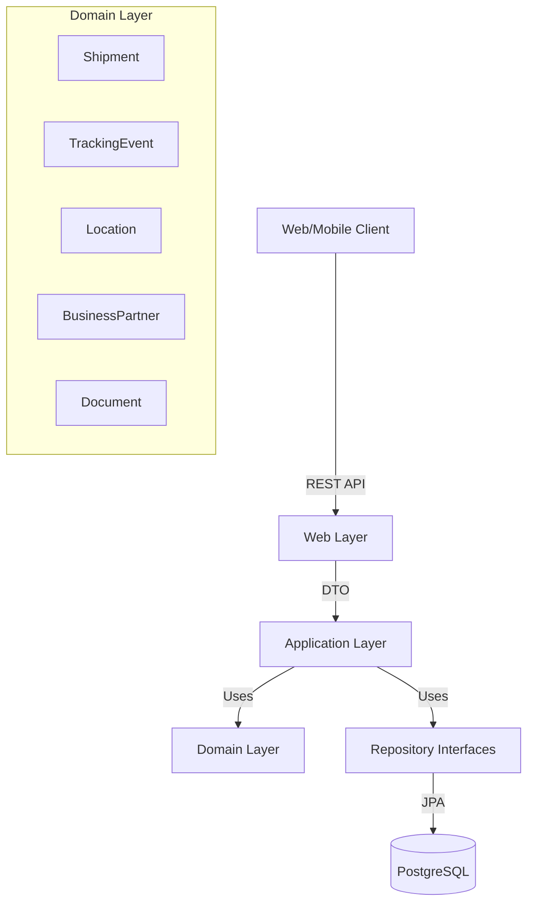

# Global Track & Trace System

## 📖 Overview
**Global Track & Trace** is a large-scale enterprise backend system designed for logistics management. It provides real-time capabilities for tracking shipments, managing lifecycle events, and handling transport documents.

The project follows a **Clean Layered Architecture**, ensuring high scalability, maintainability, and loose coupling between components.

## 🏗 System Architecture



## 🚀 Tech Stack
- **Java**: 17 (LTS)
- **Framework**: Spring Boot 3.2.x
- **Database**: PostgreSQL
- **ORM**: Hibernate / Spring Data JPA
- **Simplification**: Lombok
- **Mapping**: MapStruct
- **Documentation**: OpenAPI / Swagger UI
- **Build Tool**: Maven

## ✨ Key Features
- **Shipment Management**: Create shipments, update status, and search by tracking code.
- **Event Tracking**: Real-time event registration (Pickup, Arrival, Departure, Delivery).
- **Master Data**: Management of Locations (Ports/Warehouses) and Business Partners (Shippers/Consignees).
- **Document Handling**: Attachment of transport documents (BOL, Invoice, Packing List).
- **Audit Trail**: Complete history of status transitions and shipment lifecycle.

## 🛠 Setup & Build

### Prerequisites
- JDK 17+
- Maven 3.8+
- PostgreSQL

### Installation Steps
1.  **Clone repository**:
    ```bash
    git clone https://github.com/your-username/global-track-trace.git
    cd global-track-trace
    ```

2.  **Database Configuration**:
    - Create a PostgreSQL database named `global_track_trace`.
    - Copy `src/main/resources/application-example.properties` to `src/main/resources/application.properties`.
    - Update the `spring.datasource.username` and `spring.datasource.password` with your credentials.

3.  **Build Project**:
    ```bash
    ./mvnw clean install
    ```

4.  **Run Application**:
    ```bash
    ./mvnw spring-boot:run
    ```

5.  **Access API Docs**:
    - Swagger UI: `http://localhost:8080/swagger-ui.html`
    - API Docs (JSON): `http://localhost:8080/v3/api-docs`

## ⚙️ Configuration
**IMPORTANT**: Do not commit the actual `application.properties` containing real secrets. Use environment variables or an external configuration server for production.

| Environment Variable | Description | Default |
|----------------------|-------------|---------|
| `DB_URL` | Database Connection URL | `jdbc:postgresql://localhost:5432/global_track_trace` |
| `DB_USER` | Database Username | `postgres` |
| `DB_PASS` | Database Password | `secret` |

## 🤝 Contribution
1. Fork the project
2. Create your feature branch (`git checkout -b feature/AmazingFeature`)
3. Commit your changes (`git commit -m 'Add some AmazingFeature'`)
4. Push to the branch (`git push origin feature/AmazingFeature`)
5. Open a Pull Request

---
**Author**: SAP Labs Architect Team
